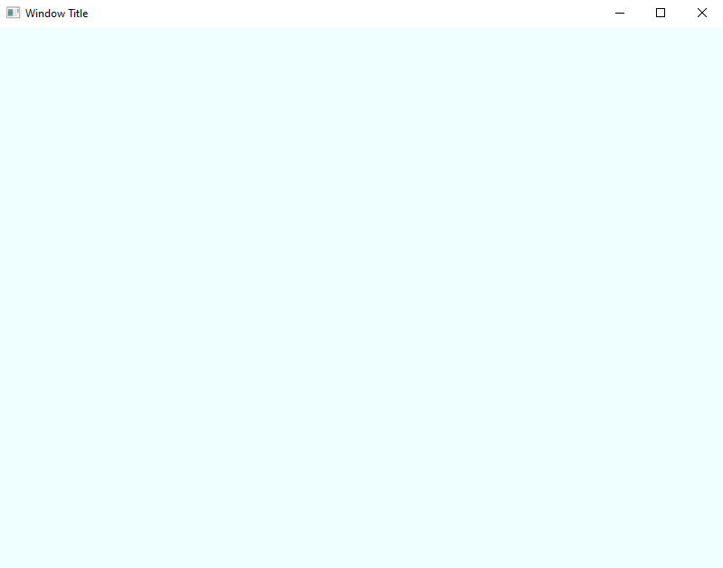
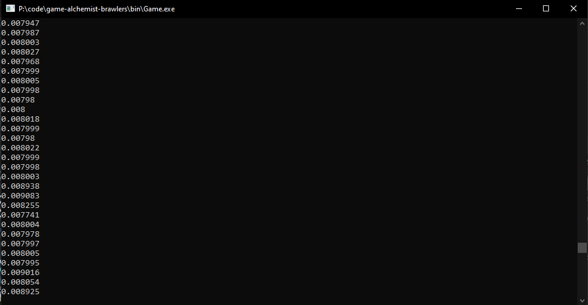

Alchemist Brawlers
===
A 2D pvp multiplayer action-platformer.
---
This game is a recovered project, which I had lost for a few years. Very little has been implemented, but I did release a [YouTube video](https://www.youtube.com/watch?v=-Rxockivre4) about plans for the project, which may be of interest.

### Install on Windows
* [Install 7-Zip](https://7-zip.org/download.html).
* [Install Git Bash](https://git-scm.com/download/win); make sure to choose "Run Git from the Windows Command Prompt" during installation. This should result in a MINGW64 Bash installation that can access your Windows PATH while having access to Linux commands (ie. the `find` command).
* [Clone this repository](https://docs.github.com/en/repositories/creating-and-managing-repositories/cloning-a-repository#cloning-a-repository) to a directory on your computer. That directory will be referred to as `root`.
* Create directory `root/lib`.
* Install SFML. In the directory `root/lib`, download and unzip the latest stable release of [GCC XX.X.X MinGW (SEH) - 64-bit](https://www.sfml-dev.org/download.php).
* Note the required GCC version of SFML you downloaded.
* Install GCC. In the directory `C:\`, download and unzip the *required SFML version* of [MinGW x86_64-XX.X.X-release-win32-seh-msvcrt-rt_vXX-revX.7z](https://github.com/niXman/mingw-builds-binaries/releases); the location of `g++.exe` should be `C:\mingw64\bin\g++.exe`.
* Add `C:\mingw64\bin` to the Windows Environment Variable [PATH](https://www.computerhope.com/issues/ch000549.htm).
* Install [Make for Windows](https://gnuwin32.sourceforge.net/packages/make.htm); the location of `make.exe` should be `C:\Program Files (x86)\GnuWin32\bin\make.exe`.
* Add `C:\Program Files (x86)\GnuWin32\bin\` to the Windows Environment Variable [PATH](https://www.computerhope.com/issues/ch000549.htm).

From here, everything should be installed to compile & run this software. Note that the Makefile assumes you want to build this with x86_64 SFML.

### Install on Arch Linux
* [Clone this repository](https://docs.github.com/en/repositories/creating-and-managing-repositories/cloning-a-repository#cloning-a-repository) to a directory on your computer. That directory will be referred to as `root`.
* [Install sfml](https://archlinux.org/packages/extra/x86_64/sfml/).

From here, everything should be installed to compile & run this software. Isn't Linux great?

### Compile & Run Scripts
To run a script, open a Bash (or equivalent) terminal within `root` and type the command.

| command | description |
|:----------- |:----------- |
| `make` | compile, link, and run the program |
| `make clean` | remove all compiled files |

### Contribute
Unfortunately, this project doesn't support community contributions right now. Feel free to fork, but be sure to read the license.
